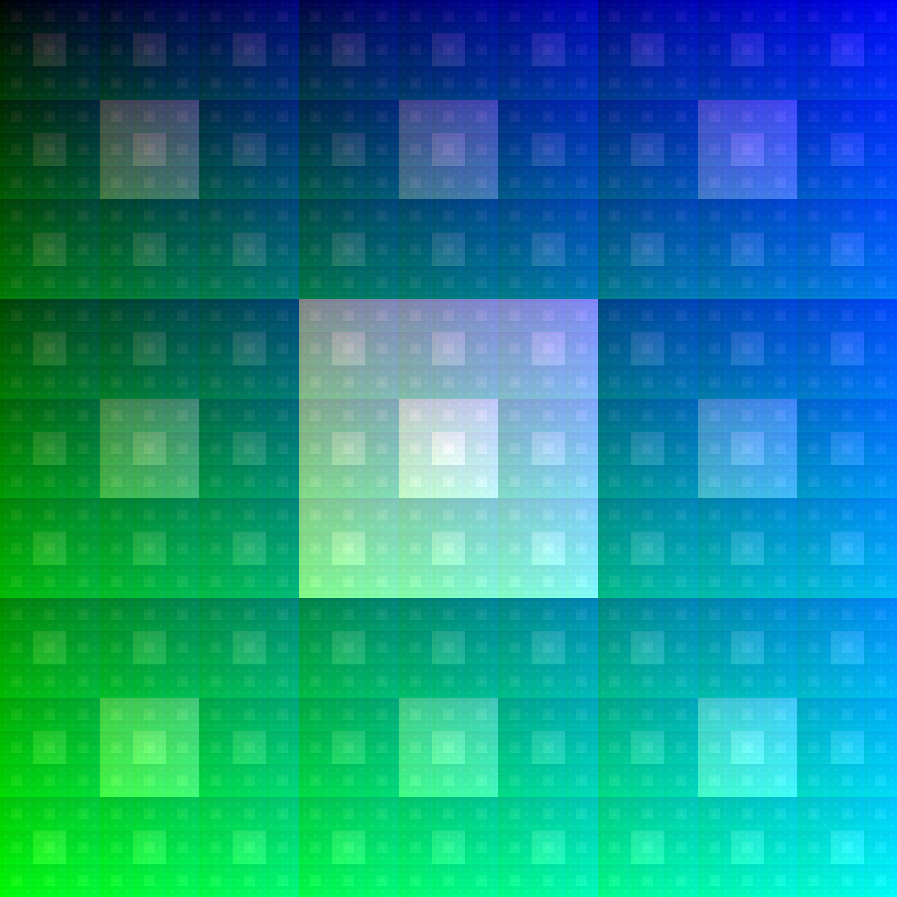

## Tile Tinkerer

## Description

**Tile Tinkerer** creates art by repeating a set mask a number of iterations and averaging the mask's color with the existing image's color.

## Usage

```sh
python ./main.py # Will output the help menu
# python ./main.py <mask1> <mask2> ...
python ./main.py \(0x0000ff,0xff0000\) \(0x0000ff,0xff0000\) # Example of how the program takes in hex color values
```


